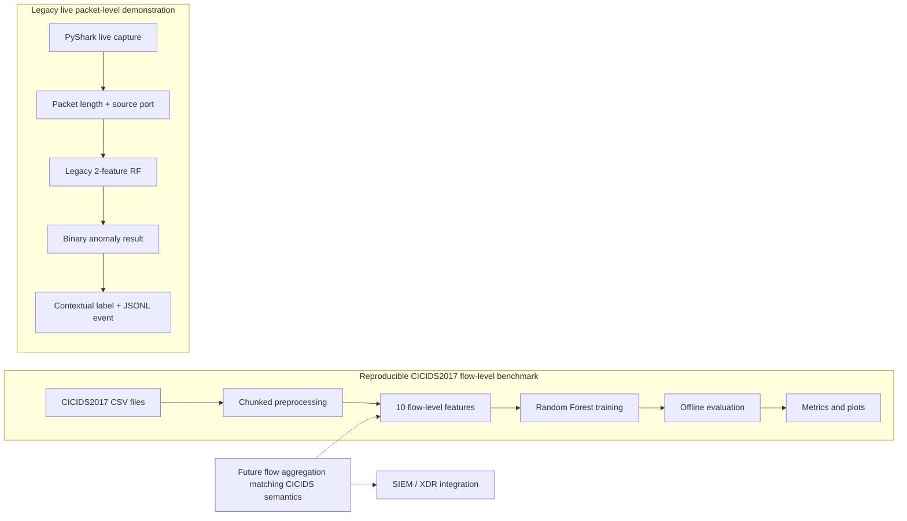
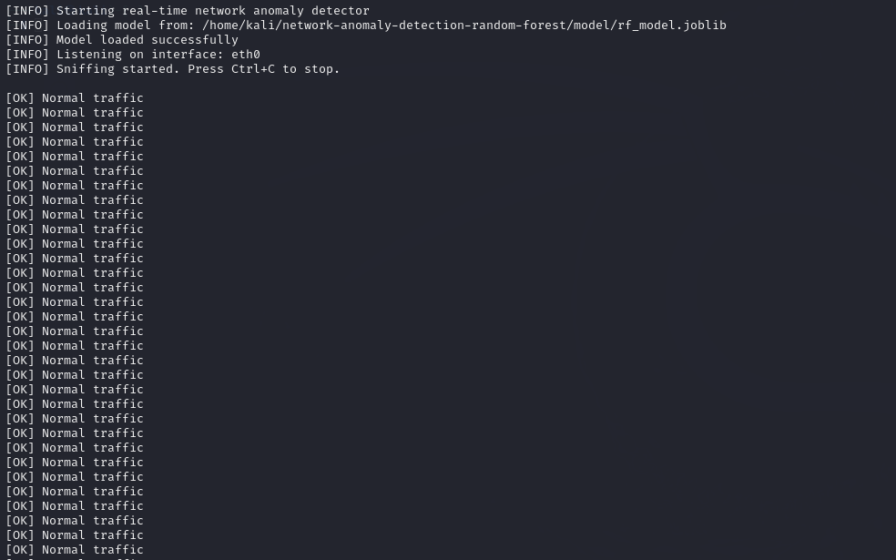
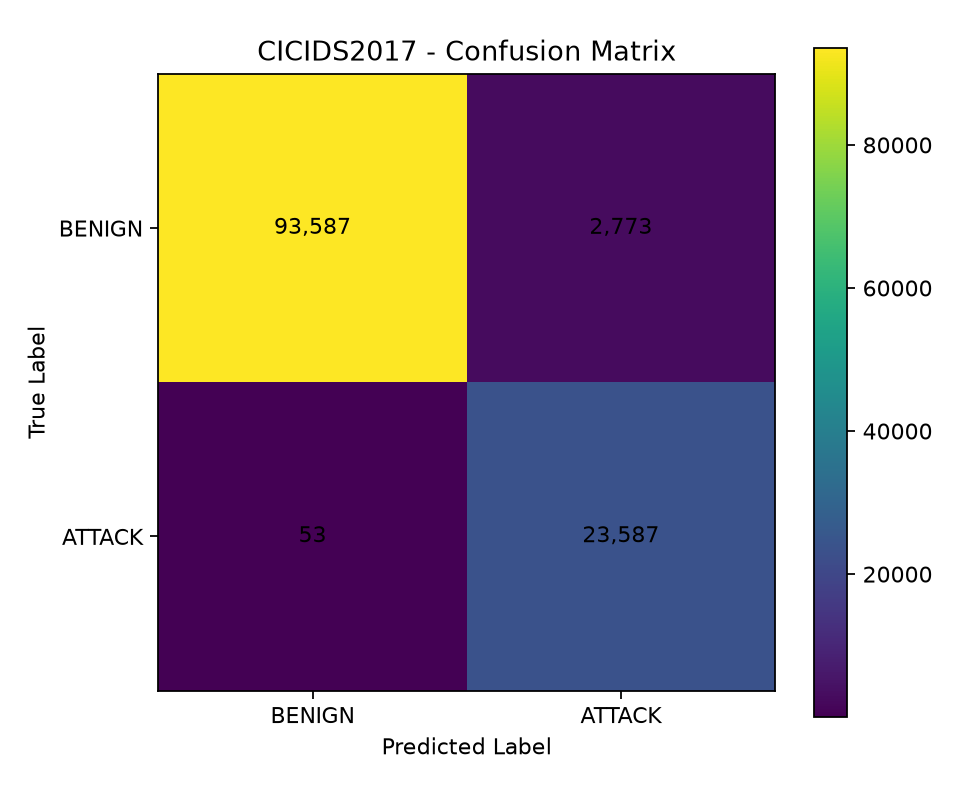
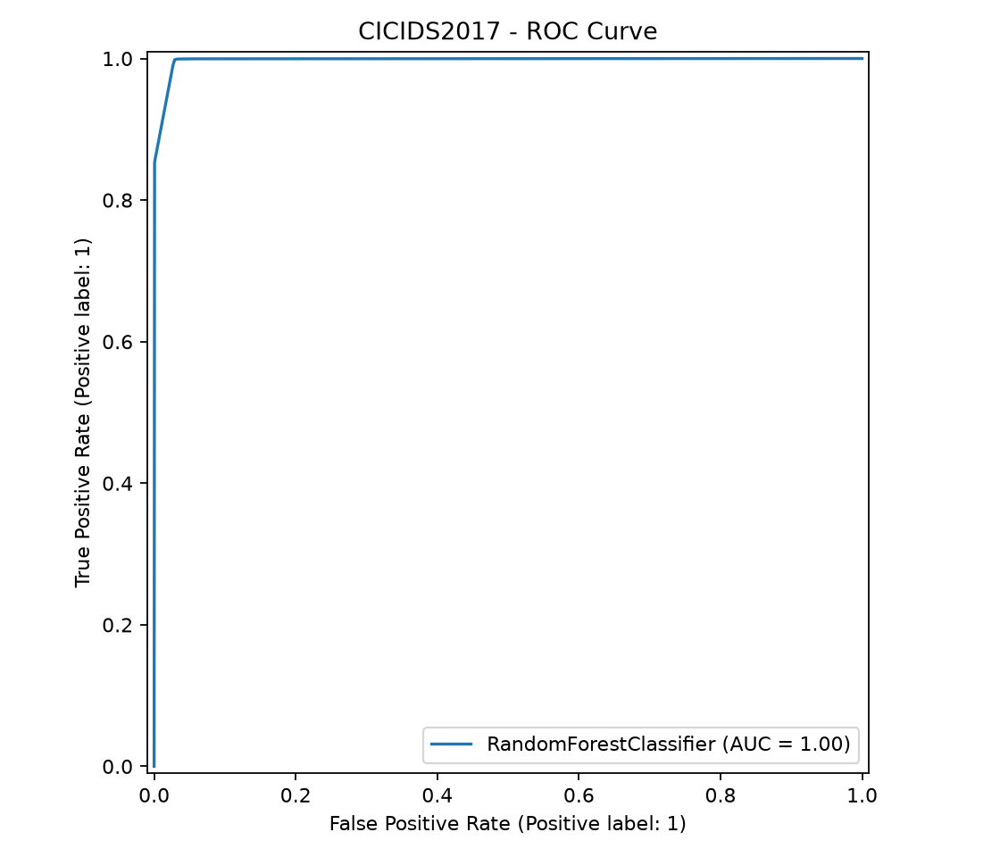
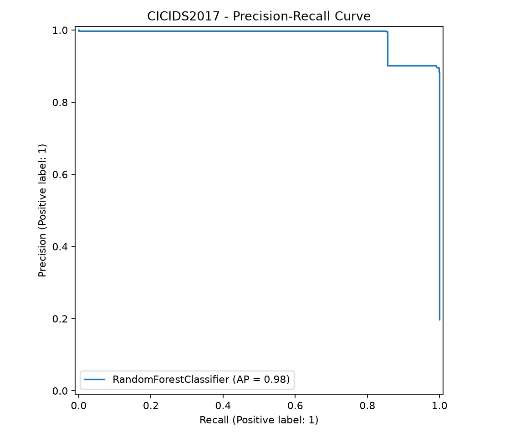
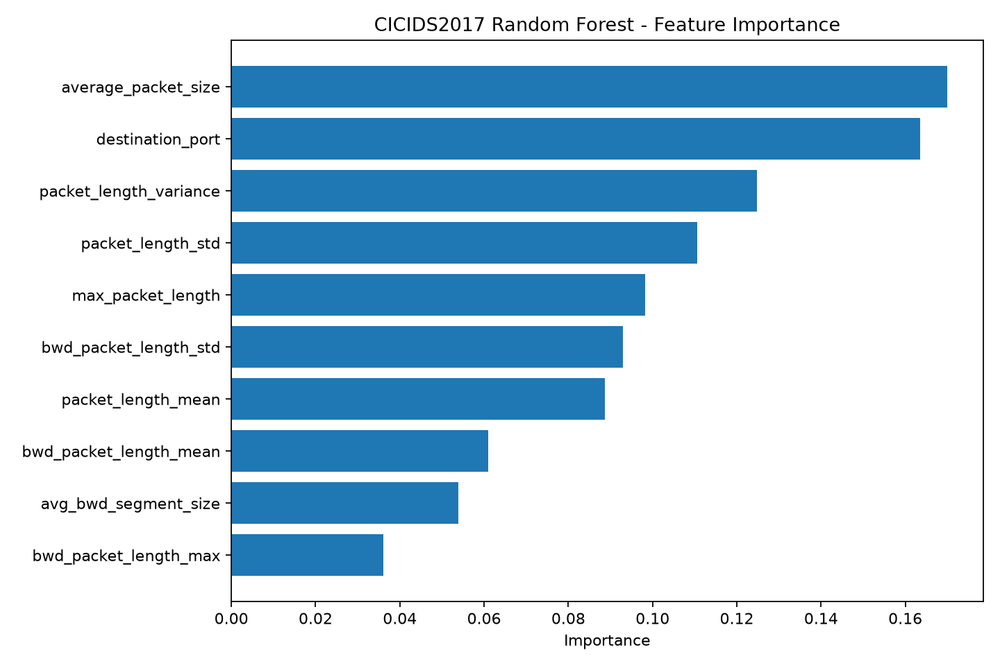

# Real-Time Network Anomaly Detection

A machine-learning network intrusion detection prototype combining Random Forest classification with live packet capture using PyShark.

Originally developed as a Bachelor's Thesis project, this repository is being refactored into a reproducible security engineering portfolio project.

## Overview

The project has two main stages:

1. **Offline model development** using network traffic data derived from CICIDS2017.
2. **Real-time detection** on Linux using PyShark for packet capture, lightweight feature extraction, Random Forest inference, and alert logging.

> **Important:** The current live Random Forest model performs binary anomaly detection. Human-readable attack names shown by the live detector are heuristic contextual labels and must not be interpreted as multiclass ML predictions.

## Architecture

The repository currently contains two related but separate detection paths:

### Architecture diagram



The dashed path represents future engineering work, not a currently implemented SIEM/XDR integration.

### Reproducible CICIDS2017 flow-level benchmark

```text
CICIDS2017 MachineLearningCVE CSV files
                  |
                  v
        Chunked preprocessing
                  |
                  v
      10 flow-level features
                  |
                  v
        BENIGN / ATTACK
          binary labels
                  |
                  v
      Random Forest training
                  |
                  v
       Offline evaluation
      metrics + result plots
```

### Legacy live packet-level demonstration

```text
       PyShark live capture
                  |
                  v
 packet length + source port
                  |
                  v
 legacy two-feature RF model
                  |
                  v
    binary anomaly result
                  |
                  v
contextual label + JSONL alert
```

> The 10-feature CICIDS2017 flow model is not used directly by the live two-feature PyShark detector. Correct live integration requires flow aggregation that reproduces the CICIDS2017 feature semantics.

See `docs/architecture.md` for design notes, `docs/training.md` for the reproducible baseline training contract, and `docs/integrations.md` for the SIEM/XDR integration direction.

## Key Capabilities

- Random Forest-based binary anomaly detection
- Live TCP/UDP packet capture with PyShark
- Automated feature extraction
- Real-time console alerts
- Detection event logging
- Tkinter-based thesis demonstration interface
- Linux/Kali Linux demonstration workflow

## Technology Stack

- Python
- scikit-learn
- pandas
- NumPy
- Joblib
- PyShark / TShark
- Tkinter
- CICIDS2017

## Repository Structure

```text
.
├── data/                  # Small safe sample inputs only
├── docs/                  # Architecture notes and screenshots
├── model/                 # Serialized demo model
├── results/               # Evaluation notes/results
├── src/                   # Detection, training, schema, and demo source code
├── README.md
├── requirements.txt
└── LICENSE
```

## Installation

Python 3.10+ is recommended.

```bash
git clone https://github.com/Umutcan44/network-anomaly-detection-random-forest.git
cd network-anomaly-detection-random-forest

python -m venv .venv
source .venv/bin/activate
pip install -r requirements.txt
```

PyShark also requires TShark/Wireshark to be installed on the host operating system.

## Real-Time Detection

The live detector currently extracts two features:

- packet length
- source port

It then runs binary Random Forest inference and records suspicious events.

The capture interface defaults to `eth0` and can be configured without editing the source:

```bash
export NAD_INTERFACE=eth0
sudo -E python src/detect.py
```

On an anomaly, the detector writes both a human-readable log and a vendor-neutral structured `events.jsonl` record.

```bash
sudo python src/detect.py
```

## Live Detection Demo

The following screenshot shows the legacy two-feature packet-level detector running on Kali Linux, successfully loading the Random Forest model, listening on `eth0`, and processing live traffic through the normal inference path.



> This screenshot validates the live capture and normal inference path. It is not evidence of attack-detection performance; benchmark performance is reported separately using CICIDS2017 below.

## Batch Demo

A desktop batch-inference demo is available with:

```bash
python src/thesis_demo.py
```

It validates the CSV feature schema before inference. The included sample CSV is intended to demonstrate input shape, not model quality.

## Reproducible Baseline Training

The repository now includes `src/train_model.py` for retraining a two-feature binary Random Forest baseline from a prepared CSV.

```bash
python src/train_model.py --input path/to/training.csv
```

See `docs/training.md` for the required schema and an explicit explanation of what is and is not currently reproducible from the original thesis environment.

## Model and Detection Limitations

This repository is a research/portfolio prototype, not a production IDS.

Current limitations include:

- The live model uses a small two-feature representation.
- Binary anomaly detection does not identify a definitive attack family.
- Contextual labels such as `Port Scan` or `UDP Flood Attempt` are heuristic demo labels.
- A single UDP packet is not sufficient evidence of a DDoS attack in a production environment.
- Production deployment would require flow aggregation, richer telemetry, calibrated thresholds, testing, monitoring, and SIEM/XDR integration.

## Results

A reproducible CICIDS2017 binary-classification benchmark was evaluated using a 600,000-flow sample and a stratified 80/20 train/test split (`random_state=42`).

| Metric | Result |
|---|---:|
| Accuracy | 97.6450% |
| Precision | 89.4803% |
| Recall | 99.7758% |
| F1 Score | 94.3480% |
| ROC-AUC | 99.7409% |
| PR-AUC | 98.3220% |

### Confusion Matrix

| | Predicted BENIGN | Predicted ATTACK |
|---|---:|---:|
| Actual BENIGN | 93,587 | 2,773 |
| Actual ATTACK | 53 | 23,587 |



### ROC Curve



### Precision-Recall Curve



### Feature Importance



The most influential features in this benchmark were `average_packet_size`, `destination_port`, `packet_length_variance`, `packet_length_std`, and `max_packet_length`.

### Evaluation Scope

These results are a controlled **CICIDS2017 flow-level benchmark**, not a claim of production IDS performance.

The evaluation uses a random stratified flow-level split. Similar traffic patterns may therefore occur across the training and test subsets, potentially producing more optimistic results than a temporal, day-based, file-based, or external-dataset evaluation.

The model performs binary `BENIGN` vs `ATTACK` classification; it does not predict individual attack families.

The complete machine-readable results are available in `results/cicids2017_metrics.json`.

## Roadmap

- [x] Publish thesis prototype
- [x] Separate live detection logic from documentation
- [x] Add reproducible two-feature baseline training pipeline
- [x] Add evaluation metrics and confusion matrix
- [x] Add architecture diagram and screenshots
- [x] Add configuration for capture interface and model path
- [x] Add core automated tests
- [ ] Containerize non-capture components
- [x] Add vendor-neutral SIEM/XDR-style JSONL event output
- [ ] Explore cloud telemetry and security automation integrations

## Responsible Use

Use this project only on networks and systems you own or are explicitly authorized to monitor.

## Author

**Umutcan Kargın**

Computer Engineering graduate focused on cybersecurity, detection engineering, security automation, and applied AI.


## Tests

Run the core tests from the repository root:

```bash
python -m unittest discover -s tests
```

The current tests validate the feature schema and structured detection-event contract.
